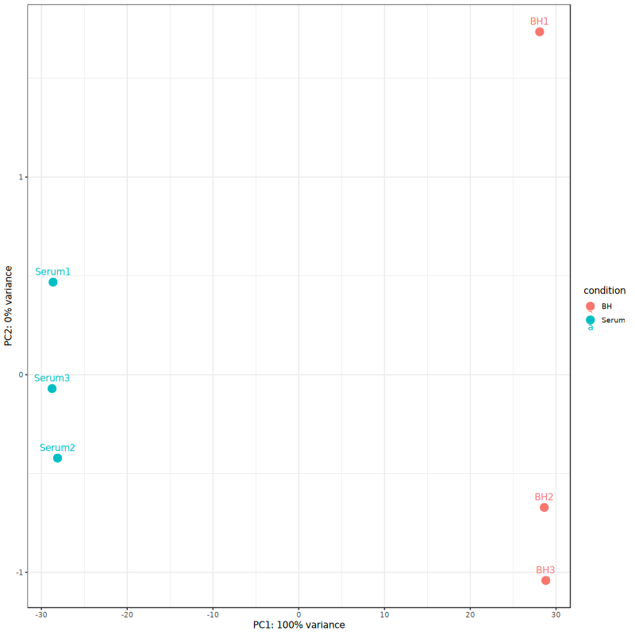
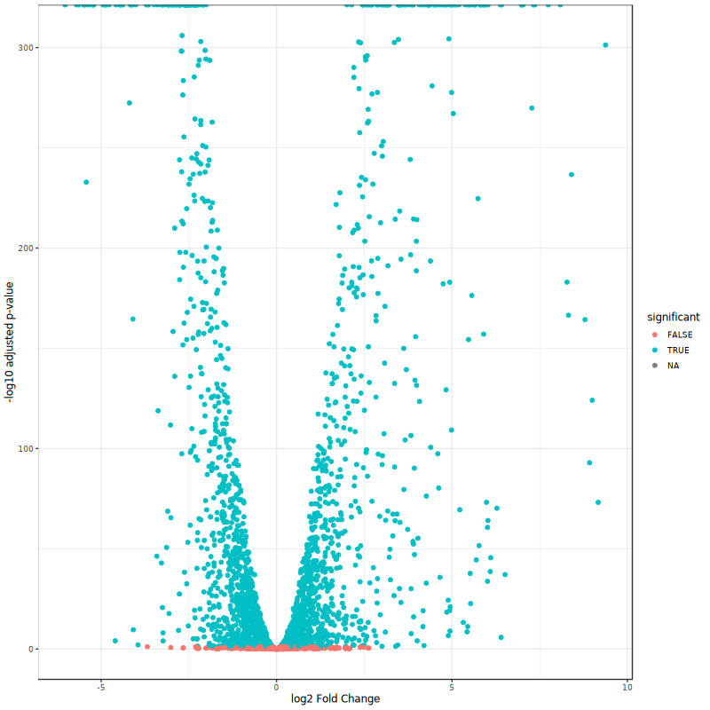
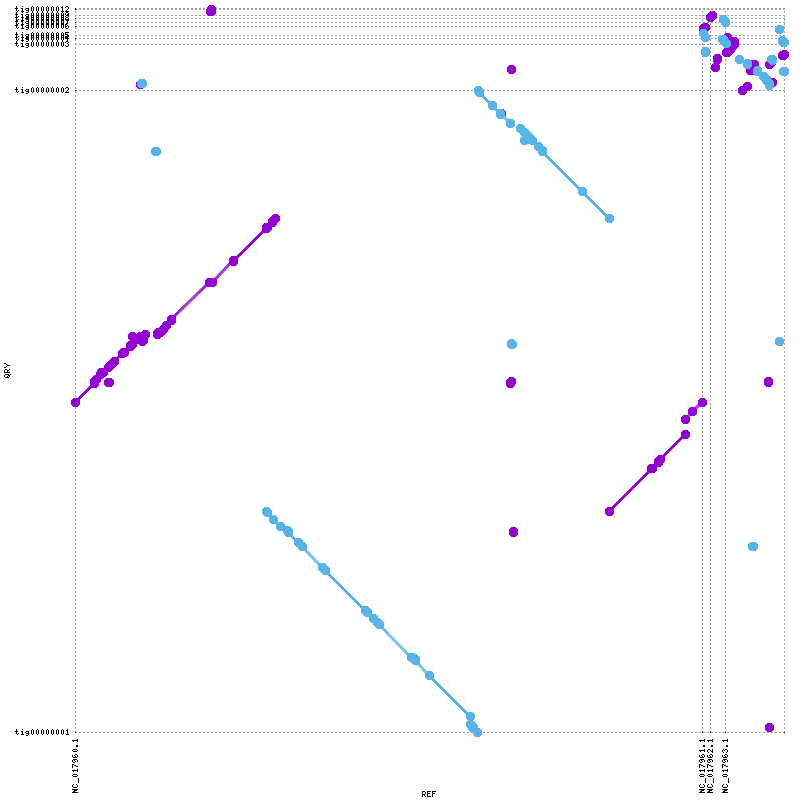

# Genome Analysis Project – Enterococcus faecium

## Overview

This project was completed as part of the Genome Analysis course at Uppsala University.

The project investigates the genome and transcriptome of *Enterococcus faecium* using PacBio long-read sequencing data together with RNA-seq data.

## Reference Paper

Zhang X, de Maat V, Guzmán Prieto AM, Prajsnar TK, Bayjanov JR, de Been M, et al.
*RNA-seq and Tn-seq reveal fitness determinants of vancomycin-resistant Enterococcus faecium during growth in human serum.*
BMC Genomics. 2017;18:893.
https://doi.org/10.1186/s12864-017-4299-9

## The workflow includes:
- Quality control and trimming
- Genome assembly
- Assembly evaluation
- Genome annotation
- RNA-seq mapping
- Read counting
- Differential expression analysis
- Antibiotic resistance analysis
- Sequence similarity analysis

All analyses were performed on the UPPMAX high-performance computing platform.
## Goal of the Project

The goal of this project was to investigate gene expression changes in *Enterococcus faecium* during growth in human serum using RNA-seq analysis.

Additional analyses including ResFinder and BLAST were performed to identify antimicrobial resistance genes and evaluate sequence similarity against reference databases.

## Biological Background

*Enterococcus faecium* is a gram-positive bacterium commonly found in the gastrointestinal tract. Some strains are clinically important because they can develop resistance to antibiotics and cause hospital-acquired infections.

Vancomycin-resistant *Enterococcus faecium* (VRE) strains are especially important in clinical microbiology because they are associated with multidrug resistance and bloodstream infections.

The purpose of this project was to reconstruct and analyze the genome of *E. faecium* using sequencing data and bioinformatics tools, while also investigating gene expression changes under human serum conditions.

## Data Used in the Project

Publicly available sequencing datasets were obtained from the NCBI Sequence Read Archive (SRA).

The project used:
- Long-read sequencing data for genome assembly
- Short-read RNA-seq data for differential expression analysis

The datasets correspond to *Enterococcus faecium* grown under different conditions, including human serum and rich medium.

Data formats used in the analyses included:
- FASTQ files for raw sequencing reads
- FASTA files for genome assembly
- BAM files for mapped reads
- GFF annotation files generated by Prokka

## Step 1: Quality Control and Trimming

### Tools
- FastQC
- MultiQC
- Trimmomatic

### Purpose
The raw sequencing reads were evaluated for sequence quality, GC content, adapter contamination, and overall read quality.

Low-quality bases and adapter sequences were removed from Illumina RNA-seq reads using Trimmomatic to improve downstream analysis quality.

### Input
- Raw sequencing reads (`.fastq.gz`)

### Output
- Quality control reports( HTML )
- Trimmed sequencing reads

## Step 2: Genome Assembly

### Tool
- Canu

### Purpose
Long-read sequencing data were assembled into a draft genome assembly using Canu.

The assembly process reconstructs genomic sequences by combining overlapping sequencing reads into longer contiguous sequences (contigs).

### Input
- Trimmed long-read sequencing data (`PacBio FASTQ files`)

### Output
- Draft genome assembly (`.fasta`)
- Assembly reports and statistics

## Step 3: Assembly Evaluation

### Tools
- QUAST
- BUSCO
- MUMmer

### Purpose
The assembled genome was evaluated for quality, completeness, and structural accuracy.

QUAST was used to assess assembly statistics, BUSCO was used to evaluate genome completeness based on conserved genes, and MUMmer was used for genome comparison and synteny analysis.

### Input
- Draft genome assembly (`.fasta`)

### Output
- Assembly quality reports
- BUSCO completeness summary
- Genome comparison and synteny plots

## Step 4: Genome Annotation

### Tool
- Prokka

### Purpose
Genome annotation was performed to identify genes, coding sequences, and other genomic features within the assembled genome.

### Input
- Genome assembly (`.fasta`)

### Output
- Annotation files (`.gff`, `.gbk`, `.faa`, `.ffn`)
- Gene annotation summary tables

## Step 5: RNA-seq Analysis

### Tools
- BWA
- SAMtools
- HTSeq
- DESeq2

### Purpose
RNA-seq reads were mapped to the reference genome to quantify gene expression levels and identify differentially expressed genes between serum and rich medium conditions.

### Input
- Trimmed RNA-seq reads (`Illumina .fastq.gz files`)
- Reference genome assembly (`.fasta`)
- Genome annotation file (`.gff`)

### Output
- BAM alignment files
- Gene count tables
- Differential expression results
- PCA and volcano plots

## Step 6: Antibiotic Resistance Analysis

### Tool
- ResFinder

### Purpose
ResFinder was used to identify antimicrobial resistance genes present in the genome and evaluate potential antibiotic resistance mechanisms.

### Input
- Genome assembly (`.fasta`)

### Output
- Resistance gene identification results
- Resistance summary tables

## Step 7: Sequence Similarity Analysis

### Tool
- BLAST

### Purpose
BLAST analysis was performed to compare query sequences against reference databases and identify sequence similarity with known genes.

### Input
- Query sequence files (`.fasta`)

### Output
- Sequence similarity matches
- Alignment result tables

## Main Results Summary

### Assembly Quality
- Total genome size: ~3.1 Mb
- High N50 value (~2.76 Mb)
- Multiple large contigs were successfully assembled
- GC content: 37.8%

These results indicate strong assembly continuity and overall assembly quality.

### BUSCO Completeness
- 98.4% complete BUSCO genes
- 96.8% complete and single-copy BUSCOs
- 1.6% duplicated BUSCOs
- 1.6% fragmented BUSCOs
- 0.0% missing BUSCOs

These results indicate a highly complete and near-complete genome assembly.

### Annotation
- ~3093 coding sequences identified
- Multiple tRNA genes detected

Genome annotation identified important genomic features and predicted coding regions within the assembled genome.

### Resistance Analysis
Multiple resistance-associated genes were identified, including genes linked to vancomycin resistance.

## Repository Contents

The repository contains:
- analysis scripts
- processed results
- plots and visualisations
- annotation files
- assembly evaluation outputs
- differential expression analysis outputs

Large intermediate files and raw sequencing data were excluded because of storage limitations.

## Key Visualizations

### PCA Plot

The PCA plot shows clear clustering between serum and BHI samples, indicating strong transcriptional differences between growth conditions.

### Volcano Plot

The volcano plot highlights significantly upregulated and downregulated genes between serum and BHI conditions.

### MUMmer Plot

The MUMmer synteny plot demonstrates structural similarity between the assembled genome and the reference genome.

## Tools Used

- **FastQC** → sequencing quality control
- **MultiQC** → summary of quality control reports
- **Trimmomatic** → read trimming and adapter removal
- **Canu** → long-read genome assembly
- **QUAST** → assembly quality evaluation
- **BUSCO** → genome completeness assessment
- **MUMmer** → genome comparison and synteny analysis
- **Prokka** → genome annotation
- **BWA** → RNA-seq read mapping
- **SAMtools** → BAM file processing and alignment handling
- **HTSeq** → gene count generation
- **DESeq2** → differential expression analysis
- **ResFinder** → antimicrobial resistance gene identification
- **BLAST** → sequence similarity analysis
- 
## Scripts

- code/fastqc.sh
- code/fastqc_rna.sh
- code/fastqc_trimmed.sh
- code/trimmomatic.sh
- code/bwa_index.sh
- code/bwa_mapping.sh
- code/htseq_count.sh
- code/canu.sh
- code/quast.sh
- code/busco.sh
- code/mummer.sh
- code/prokka.sh
- code/deseq2.sh

## Biological Interpretation

The analyses performed in this project provide important insights into how vancomycin-resistant *Enterococcus faecium* adapts to nutrient-limited environments such as human serum.

RNA-seq analysis showed that many genes changed expression levels between growth in rich medium (BHI) and growth in serum conditions. These transcriptional changes indicate that *E. faecium* undergoes extensive metabolic adaptation in response to environmental stress and nutrient limitation.

Several genes showed strong differential expression patterns together with statistically significant adjusted p-values, indicating clear transcriptional differences between experimental conditions.

An important observation from the analysis was the likely involvement of genes associated with:

- metabolic adaptation
- nutrient acquisition
- stress response pathways
- survival under nutrient-limited conditions

These findings are biologically consistent with the reference study by Zhang et al. (2017), where metabolic adaptation and nutrient acquisition pathways were identified as important factors for bacterial fitness during bloodstream growth.

The observed expression patterns suggest that human serum represents a stressful and nutrient-limited environment where bacteria require coordinated physiological adaptation for survival.

Assembly evaluation further demonstrated that the assembled genome was highly complete, with BUSCO analysis identifying approximately 98% complete conserved bacterial genes. This indicates that the genome assembly was suitable for downstream annotation and transcriptomic analyses.

Genome annotation identified approximately 3093 coding sequences together with multiple RNA genes, providing biologically meaningful genomic information for functional analysis.

Resistance analysis further demonstrated the presence of clinically relevant antimicrobial resistance determinants, supporting the characterization of the isolate as a multidrug-resistant VRE strain.

Together, these findings demonstrate that successful bloodstream survival of *E. faecium* depends on coordinated metabolic adaptation, stress response mechanisms, nutrient acquisition, and antimicrobial resistance.

## Discussion

This project followed the main workflow of the reference study and provided practical experience with bacterial genome assembly, annotation, and RNA-seq analysis.

Using PacBio long-read sequencing data, a high-quality genome assembly of *Enterococcus faecium* was generated. The assembly showed strong completeness and quality according to QUAST and BUSCO results, indicating that the genome assembly was suitable for downstream analyses such as annotation, RNA-seq mapping, and resistance analysis.

Genome annotation identified thousands of predicted coding sequences together with multiple RNA genes involved in important biological processes such as metabolism, transport, stress response, and antimicrobial resistance. These analyses provided biologically meaningful information about the genomic features present in the assembled genome.

RNA-seq differential expression analysis demonstrated that *E. faecium* changes its gene expression patterns when growing in human serum compared with rich medium conditions. This suggests that the bacterium undergoes extensive metabolic and physiological adaptation in response to nutrient limitation and environmental stress.

Several genes showed strong differential expression patterns together with statistically significant adjusted p-values, indicating clear transcriptional differences between experimental conditions.

The observed expression patterns were generally consistent with the biological trends reported in the reference study. In particular, genes associated with metabolic adaptation, nutrient acquisition, and stress response pathways appeared to play important roles during serum growth conditions.

Resistance analysis also identified several antimicrobial resistance-associated genes, which is consistent with the multidrug-resistant characteristics of vancomycin-resistant *Enterococcus faecium* strains.

Overall, this project demonstrated how genome assembly, annotation, transcriptomics, and resistance analysis can be integrated to investigate bacterial adaptation, pathogenicity, and clinically relevant resistance mechanisms. The project also provided practical experience with bioinformatics workflows and high-performance computing analyses performed on UPPMAX.

## Conclusion

The genome of *Enterococcus faecium* was successfully assembled and analysed using long-read sequencing and RNA-seq data.

Assembly evaluation using QUAST, BUSCO, and MUMmer demonstrated:
- high assembly quality
- strong genome completeness
- structural similarity to the reference genome

Genome annotation identified biologically relevant genomic features and predicted coding sequences within the assembled genome.

RNA-seq analysis enabled investigation of gene expression changes under serum conditions, while ResFinder identified clinically relevant antimicrobial resistance genes.

BLAST analysis further confirmed sequence similarity between query sequences and reference database entries.

Overall, this project demonstrates a complete bacterial genome analysis workflow using modern bioinformatics tools and high-performance computing resources on UPPMAX.

Notes
Raw data and large output files are not included
Only scripts and selected results are provided
All analyses were performed on UPPMAX
